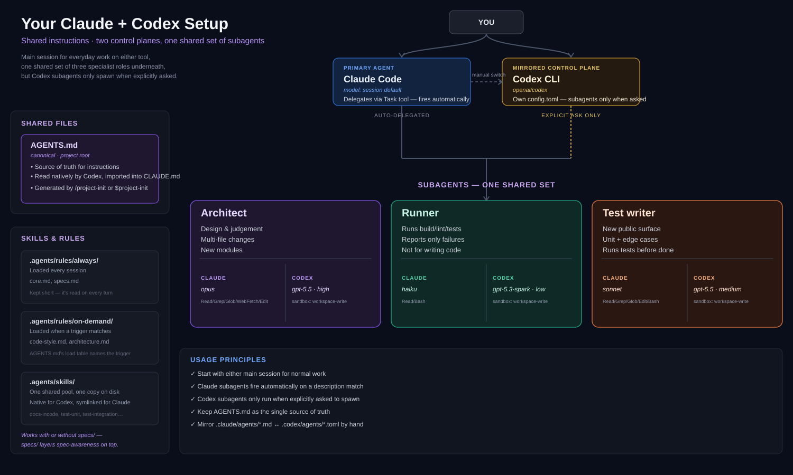

# Claude + Codex Spec-Driven Agent Template

A template repo for running Claude Code and Codex CLI over the same project, with:

- **One instruction file** — `AGENTS.md`, the entry point, kept short.
- **A shared rules pool** — `.agents/rules/`, split into always-loaded and load-on-demand.
- **A shared skill pool** — `.agents/skills/`, read natively by Codex and symlinked for Claude.
- **A specs tree** — `specs/`, every spec linked to its parent and to the code it owns.
- **One setup command** — `/project-init`, which reads your actual codebase and writes the rest.

Nothing here is filled in by hand. `AGENTS.md`, `CLAUDE.md`, and the whole `specs/` tree are
generated from your repository by `/project-init`, which asks you for whatever the code cannot tell
it and leaves a placeholder rather than guessing.



## Quick start

**New project** — on GitHub, click **Use this template → Create a new repository**. This gives you
a normal new repo seeded from this one's contents, with no fork/upstream relationship attached —
the standard way to start a project from a GitHub template. Clone it, open it in Claude Code, and
run `/project-init`. Work through whatever it lists at the end under "Still needs input."

**Existing project** — copy in `.agents/`, `.claude/`, `.codex/`, `specs/`, `.mcp.json`, then run
`/project-init` the same way. It never overwrites a file it did not write, including an
`AGENTS.md` you already have — it only fills placeholders and appends missing sections.

`/project-init` links skills automatically as part of setup.

## How the pieces fit

```
AGENTS.md                            entry point — generated, ~40 lines, loads every session
├─ read .agents/rules/always/*       always on — a folder you manage, not a hardcoded list
├─ load table (inside AGENTS.md)     →   .agents/rules/on-demand/*.md, read when a row matches
└─ spec map                     →   specs/INDEX.md  →  the owning spec for any given file
```

Three tiers, by cost:

| Tier | Where | Loaded |
|---|---|---|
| Always-on | `AGENTS.md` + everything in `.agents/rules/always/` | every session |
| Conditional | `.agents/rules/on-demand/*.md` | when the load table's condition is met |
| Project knowledge | `specs/**` | when you touch code the spec owns |

"The load table" is a literal table inside `AGENTS.md` itself (generated from
`.agents/templates/AGENTS.template.md`) — it's what actually implements the "Conditional" row
above. It looks like this:

| Before you… | Read |
|---|---|
| edit any file listed in the spec index | its owning spec (look it up, see below) |
| write or change production code | `.agents/rules/on-demand/code-style.md` |
| write or change tests | `.agents/rules/on-demand/testing.md` |
| add a module, move a boundary, choose between designs | `.agents/rules/on-demand/architecture.md` |

An agent about to do one of the things in the left column reads the file named in the right column
first. Add a file to `.agents/rules/on-demand/`, add a row here pointing at it — unlike
`.agents/rules/always/`, which needs no table entry per file since "read everything in this folder"
already covers whatever's added to it.

The point of the split is that the always-on tier stays small enough to actually be followed.
`.agents/rules/always/` is a real folder you edit directly — add a file, it loads next session;
nothing else needs to change to register it. See `.agents/README.md` for why that's a plain read
instruction rather than Claude's `@` import syntax.

## Specs

All specs live under `specs/`. Never inside a code module — one tree, one place to look.

```
specs/
├── INDEX.md            generated — routing table: code glob → owning spec
├── 00-brief.md         root — goal, users, non-goals, constraints
├── 01-architecture.md  components and boundaries
├── 02-tech.md          stack, libraries, setup
├── stories/            optional — multi-module work, see below
└── features/           one per feature, each owning a code glob
```

Acceptance criteria are full Given/When/Then, named and numbered, not one-line summaries — a bare
"- [ ] retry on network failure" doesn't say how many attempts or what backoff, so nothing (human
or AI) can actually build or verify it from that text alone. See `.agents/templates/spec-feature.md`
for the exact shape.

Every spec declares `parent` (its place in the tree) and `owns` (the code globs it is the source of
truth for). `specs/INDEX.md` is built from every `owns` entry, sorted most-specific-first, so an
agent about to edit `src/checkout/pay.ts` finds `specs/features/checkout.md` by matching the first
row that applies — and can walk `parent` upward for wider context.

That is the whole navigation mechanism: `AGENTS.md` → `INDEX.md` → the spec → its parents.

Every spec that has one carries its own `Decisions` section — what was decided, why, and what was
rejected — scoped to whatever that spec owns. A decision that isn't scoped to one feature belongs
in `01-architecture.md`'s Decisions section instead.

**Stories** (`specs/stories/`) are for the case where one piece of work fans out across several
modules — the full product-level Given/When/Then lives once, in the story, and each module's
feature spec references which criteria it satisfies via an `Implements` section rather than
repeating them. Most work doesn't need this tier; use it only when a single feature spec would
mean either duplicating the contract across files or losing it entirely. Whether a given task
under a story gets its own feature-spec file or just folds into an existing one as another
criterion is a size call made at architecting time — see `.agents/rules/always/specs.md`.

Specs also carry an optional `jira:` frontmatter field — a pointer to the source ticket, visible
when you open the spec, not a synced mirror. Ticket status and spec `status` deliberately stay
separate; see the `jira:` row in `.agents/rules/always/specs.md`'s Writing table for why.

Each spec's own `status` field and checkboxes are the source of truth for its state, and
`INDEX.md` tells you which spec owns which code — open the spec to see where it actually stands.
Current focus for a piece of work lives inside that work's own feature spec.

**Full coverage is never the goal, especially not on day one.** Most of a large or long-lived
codebase should stay unspecced for a long time — `spec-sync` reports that as "Not yet specced" in
`INDEX.md`, purely informational, and `--check` never fails on it, only on genuine problems (a
dangling glob, ambiguous ownership). Coverage grows the same way the rest of this system works:
one task at a time, via `spec-new`, when work actually touches an area — not as an upfront project.
A new spec for an existing area can start out narrow (covering only the part you're touching right
now) and describe what the code actually does rather than an aspirational rewrite of it; both are
completely normal, not a shortcut to fix later.

For handing work off to somewhere with **no repo access at all** — a fresh conversation, a
different model, a plain browser chat — that's a different problem, solved by the `session-snapshot`
skill below, not by anything living in `specs/`.

## Skills

| Skill | Claude | Codex | Does |
|---|---|---|---|
| `project-init` | `/project-init` | `$project-init` | one-time setup: detects the stack, generates AGENTS.md and the specs tree, fills every placeholder, links skills, asks about the rest |
| `spec-new` | `/spec-new` | `$spec-new` | adds a spec with correct frontmatter, parent, and ownership glob |
| `spec-sync` | `/spec-sync` | `$spec-sync` | regenerates `INDEX.md`, reports *structural* drift (globs, missing owners) |
| `spec-from-code` | `/spec-from-code` | `$spec-from-code` | reconciles a spec's content to match code you changed by hand. Code is ground truth. Direct request only. |
| `spec-to-code` | `/spec-to-code` | `$spec-to-code` | implements whatever a hand-edited spec now requires that the code doesn't yet do. Spec is ground truth. Direct request only. |
| `project-link-skills` | `/project-link-skills` | `$project-link-skills` | syncs a newly added/renamed/removed skill into `.claude/skills/`. Safe to run proactively — no terminal step required, ever. |
| `session-snapshot` | `/session-snapshot` | `$session-snapshot` | writes a short handoff note and attaches whatever files (specs, code, docs) the next session actually needs. Direct request only. |

`spec-sync` only catches *structural* drift — a glob matching nothing, an unowned directory. It
has no way to know that a spec's prose no longer describes what the code actually does, or that a
spec was edited ahead of the code that should satisfy it — that's a reading-and-judgment problem,
not something a frontmatter scan can check. `spec-from-code` and `spec-to-code` are the pair that
covers that gap, one direction each; see "Gotchas" below for why both default to direct-request only
rather than running the moment a mismatch is noticed.

One flat pool: everything that ships with the template and everything you add yourself lives
together in `.agents/skills/`. Codex scans `.agents/skills` from the working directory up to
the repo root natively; `/project-init` fills `.claude/skills` with symlinks to the same directories
so Claude sees them too. Both tools follow symlinks into skill folders, so there is exactly one copy
of each skill on disk. `.agents/scripts/link-skills.sh` (or `.ps1` on Windows) is the script that
does the actual work — `/project-init` calls it during setup, and the `project-link-skills` skill calls it
any time after, so it's never something you run from a terminal yourself.

Add your own the same way: a new folder under `.agents/skills/` with a `SKILL.md` inside, then ask
(or let `project-link-skills` notice on its own) to get it linked — see `.agents/README.md`'s "Adding a
skill." Nothing marks a skill as template-owned versus your own; that's a distinction you keep
track of, not one the folder structure enforces.

`session-snapshot` favors attaching real files over restating their contents — if this repo has a
`specs/` tree, the relevant spec files get attached directly (drag-and-drop ready) rather than
summarized into the snapshot document, since the spec already is the full-context artifact and a
summary of it would just be a worse copy.

Both tools also keep every skill's name and description in context from the start of a session and
can invoke a matching one on their own — invocation by name (`/skill`, `$skill`) is not the only
way a skill gets used, it's just the explicit one.

Custom prompts are deliberately not used: Codex deprecated them in favour of skills, and they live
in your Codex home directory rather than the repo, so they cannot be shared through version control.

## Subagents

| Name | Claude | Codex | Fires on |
|---|---|---|---|
| `architect` | opus | gpt-5.5 | multi-file refactors, new modules, design choices |
| `code-reviewer` / `code_reviewer` | haiku | gpt-5.3-codex-spark | any non-trivial edit, before reporting done |
| `test-writer` / `test_writer` | haiku | gpt-5.3-codex-spark | new public surface |

All three are spec-aware: the architect reads the affected specs before proposing and records
binding decisions in whichever spec they belong to, the reviewer checks the diff against the
owning spec (and flags a spec that should have changed but did not), and the test-writer derives
its cases from the spec's acceptance criteria.

"Fires on" describes Claude. On Codex the same rows describe what the *main session has been
instructed to delegate for* — see Gotchas.

## Claude ↔ Codex compatibility

| | Claude Code | Codex CLI | Shared? |
|---|---|---|---|
| Instructions | `CLAUDE.md` (imports `@AGENTS.md`) | `AGENTS.md`, natively | via the import |
| Always-on rules | reads `.agents/rules/always/*` on instruction | same, natively | yes — plain instruction, not `@` import |
| Skills | `.claude/skills/` | `.agents/skills/` | yes, via symlink |
| Subagents | `.claude/agents/*.md` | `.codex/agents/*.toml` | no shared schema — sync by hand |
| Permissions | `permissions.allow/ask/deny` | `approval_policy` + `sandbox_mode` | no — sync by hand |
| MCP | `.mcp.json` | per-agent `[mcp_servers.*]` | protocol yes, pointer file no |

## Gotchas

- **Codex never delegates on its own.** A matching `description` alone does nothing. If AGENTS.md's
  Working style bullets are phrased as trigger conditions instead of direct instructions, the
  subagents simply never get used and nothing tells you.
- **`specs/INDEX.md` is generated.** Editing it by hand works until the next `spec-sync` run
  silently discards your edit. It is in the `deny` list in `.claude/settings.json` for that reason.
- **A file with two equally-specific owners is a bug**, not a tie to break. `spec-sync` reports it.
- **Symlinks on Windows** need Developer Mode or `git config core.symlinks true`. Without either,
  `project-link-skills` (the skill, or the script it wraps) writes forwarding stubs instead — functional,
  one extra file read per invocation.
- **If `CLAUDE.md` and `AGENTS.md` drift**, Claude Code prefers `CLAUDE.md`'s own content over the
  import. Keep `CLAUDE.md` at one line unless you have Claude-only rules to add below it.
- **`spec-from-code` and `spec-to-code` rewrite content, not just links** — that's why both are
  direct-request only, unlike `project-link-skills`. A tool that silently rewrites a constraint to match
  code that regressed, or silently implements its own interpretation of an open question, can erase
  a decision someone made on purpose. Flagging a mismatch is safe to do unprompted; resolving it
  isn't.
- Check the `deny` list in `.claude/settings.json` whenever a new secret-bearing file type appears.

## Keeping it honest going forward

The two things that rot fastest, worth knowing rather than a checklist to run through:

1. **Specs vs. code, structurally.** `python3 .agents/skills/spec-sync/scripts/build_index.py
   --check` exits non-zero on drift — wire it into CI or a pre-commit hook and an unowned directory
   or a dangling `owns` glob fails loudly instead of quietly. This only catches structure (globs,
   ownership), not content — `code-reviewer` is what flags when a spec's *content* should have
   changed alongside the code and didn't; `spec-from-code` is what you run to actually fix that.
2. **The hand-synced pairs.** `.claude/settings.json` ↔ `.codex/config.toml`, and each
   `.claude/agents/*.md` ↔ `.codex/agents/*.toml`. No shared schema, no tooling. Update both in the
   same commit when you tune one.
